```{r setup, include=FALSE}
library(knitr)
knitr::opts_chunk$set(echo = FALSE)

library(xaringanthemer)
style_solarized_light()
```

```{css, echo = FALSE}
.remark-slide-content {
  font-size: 20px;
  padding: 20px 80px 20px 80px;
}
.remark-code, .remark-inline-code {
  background: #f0f0f0;
}
.remark-code {
  font-size: 20px;
}
.huge .remark-code { /*Change made here*/
  font-size: 200% !important;
}

.med .remark-code { /*Change made here*/
  font-size: 75% !important;
}

.small .remark-code { /*Change made here*/
  font-size: 50% !important;
}

.small2 .remark-code { /*Change made here*/
  font-size: 45% !important;
}

.tiny .remark-code { /*Change made here*/
  font-size: 35% !important;
}
```

```{r, echo=FALSE, out.width="80%", fig.align='center'}
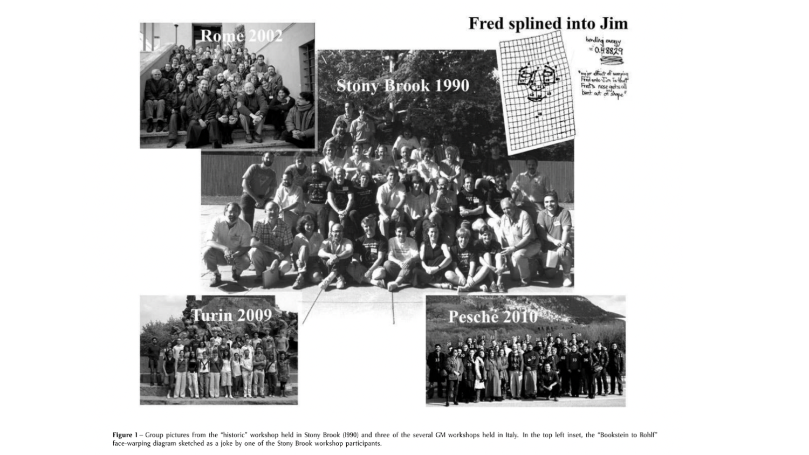
```

###### From Hystrix, Italian Journal of Mammalogy, Volume 24, Issue 1 (2013) Virtual Morphology and Evolutionary Morphometrics in the new millennium..
---

### Twenty years ago, this is what a workshop in geometric morphometrics might look like


```{r, echo=FALSE, out.width="80%", fig.align='center'}
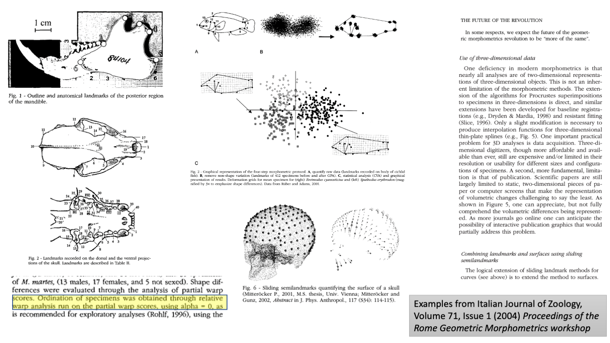
```
---

### Ten years ago, this is what a workshop in geometric morphometrics might look like

```{r, echo=FALSE, out.width="80%", fig.align='center'}
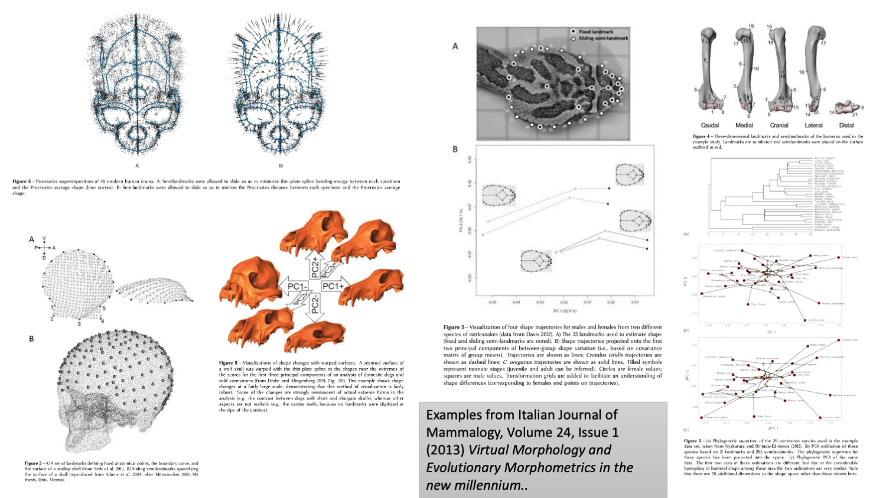
```
---

### Today, workshops in geometric morphometrics probably 

+ No longer consider high-dimensional data an issue
+ Wrestle less with appropriateness of data but wrestle more with appropriateness of analysis using the data
+ Focus more on modularity, integration, and combination of multiple "shapes"
+ (For macroevolutionary studies) focus on phylogenetic signal, accounting for phylogenetic relatedness, appropriate evolutionary models, etc.; i.e., multivariate phylogenetic comparative methods.

---

### What most workshops probably don't do (but I will explicitly do here)

Discuss the computational burdens that make empirical studies using 

  + large 3D data sets
  + generalized least-squares analysis
  + sliding landmark algorithms
  
feasible for empirical researchers.

#### Challenge for programmers.

#### But new opportunities for methodological advance

#### Tendencies we should avoid.

---

## A simple theme for describing a linear model

+ Let $\mathbf{Y}$ be an $n \times p$ matrix of data (e.g., Procrustes residuals, Boas coordinates, or any other kind of data for continuous variables)
+ Let $\mathbf{X}$ be an $n \times k$ matrix of **model** parameters (e.g., sex, population, species, size, or any other covarying features of organismal data, $\mathbf{Y}$)
+ Let $\mathbf{\Omega}$ be an $n \times n$ symmetric matrix of describing the expected relatedness among $n$ observations (e.g., evolutionary relationships, temporal or spatial associations)

#### Model Coefficients

$$\mathbf{\hat\beta} = \left( \mathbf{X}^T \mathbf{\Omega}^{-1} \mathbf{X}\right)^{-1} \mathbf{X}^T \mathbf{\Omega}^{-1} \mathbf{Y}$$

---

## A simple theme for describing a linear model

#### Model Predictions

$$\mathbf{\hat{Y}}=\mathbf{\tilde{X}} \mathbf{\hat\beta} = \mathbf{\tilde{X}} \left( \mathbf{X}^T \mathbf{\Omega}^{-1} \mathbf{X}\right)^{-1} \mathbf{X}^T \mathbf{\Omega}^{-1} \mathbf{Y} = \mathbf{HY}$$

$\mathbf{H}$ is a "hat" matrix and can be psychologically interpreted as "what this model tells me!"  $\mathbf{H}$ finds **fitted values** if $\mathbf{\tilde{X}}=\mathbf{X}$ or **predicted values** if $\mathbf{X}$ is described for novel data.

$\mathbf{H}$ looks a little like "hypothesis" and can be thought of as a hypothetical explanation for data.  

Hypotheses can be compared (direct comparison of different $\mathbf{HY}$ products) in statistical analysis.

---

### What can we do with $\mathbf{H}$?

#### Generalized Procrustes analysis (GPA) is merely a way of updating $\mathbf{H}$ is a systematic way.

$$\mathbf{Z} = s^{-1} \left( \mathbf{Y} -  \mathbf{HY} \right) \mathbf{R} =\mathbf{Z} = s^{-1} \left( \mathbf{I} -  \mathbf{H} \right) \mathbf{YR}$$
+ $s$ is a scalar equal to 1 (Boas coordinates) or centroid size (Procrustes residuals).
+ $\left( \mathbf{I} -  \mathbf{H} \right)$ is a centering of landmark configurations.
+ $\mathbf{Y}$ is a landmark configuration (which could also be updated with sliding semilandmarks... more later).
+ $\mathbf{R}$ is a rotation matrix.

$$\mathbf{H} = \mathbf{X} \left( \mathbf{X}^T \mathbf{\Omega}^{-1} \mathbf{X}\right)^{-1} \mathbf{X}^T \mathbf{\Omega}^{-1}$$

where: $\mathbf{X}$ is a vector of 1s (length = number of landmarks); $\mathbf{\Omega} = \mathbf{I}_{p \times p}$

**Translation: we use a linear model to update landmark coordinates for GPA iterations**
---

### What can we do with $\mathbf{H}$?

#### Sliding semi-landmarks in GPA is merely a way of updating $\mathbf{H}$ is a systematic way.

$$
\mathbf{H} = - \left( \mathbf{U}^T \mathbf{L}_k^{-1} \mathbf{U}\right)^{-1} \mathbf{U}^T \mathbf{L}_k^{-1},
$$
+ $\mathbf{U}$ is like $\mathbf{X}$, with 0 for fixed landmarks, tangents for semilandmarks.

+ $\mathbf{L}_k$ is like $\mathbf{\Omega}$, and is the Kronecker product, $\mathbf{I}_{k \times k} \otimes \mathbf{L}$ for $k$ dimensions of landmarks; $\mathbf{L}$ is the bending energy matrix for $p$ landmarks.

In each *sliding* iteration, 

$$\mathbf{y}^{'} = \mathbf{y} +\mathbf{Hy}$$
where, $\mathbf{y} = vec(\mathbf{Y})$; i.e., make the matrix of landmarks into a single vector.

**Translation: we use a linear model to update landmark coordinates for semilandmarks.**

---

### What can we do with $\mathbf{H}$?

#### Obtaining Sums of Squares $(SS)$ for ANOVA


$$\mathbf{\hat{Y}}_{full} = \mathbf{H}_{full}\mathbf{Y}$$

$$\mathbf{\hat{Y}}_{reduced} = \mathbf{H}_{reduced}\mathbf{Y}$$

$$SS = trace \left( \mathbf{\hat{Y}}_{full}^T \mathbf{\hat{Y}}_{full} -  \mathbf{\hat{Y}}_{reduced}^T \mathbf{\hat{Y}}_{reduced} \right)$$

$$SS = trace \left( \Delta\mathbf{HY}^T\mathbf{Y}\Delta\mathbf{H}\right)$$

**Translation: we use various linear models and contrast their transformations of data to obtain $SS$, and thus, perform ANOVA.**

---

### The Take-home point

For $\mathbf{Y}$ (landmarks in one configuration or the shape variables from many configurations)

+  $\mathbf{HY}$ is a model for their transformation.

#### However, likely not what your stats software (like `R`) is doing!

+ $\mathbf{H}$: typically symmetric matrix, might be large, and might contain many 0s
+ $\mathbf{Y}$: can be a large matrix, either long (many observations or points), wide (many variables), or both.

**Often $\mathbf{H}$ has lots of 0s**

Asking the computer to devote much memory to storing and multiplying 0s means a bad time for the researcher with large data sets.

---
### A simple linear model example

A "full" model ** complex yet sparse**

.small[
```{r, echo = TRUE, include=TRUE, out.width="35%", fig.align='center'}
library(Matrix)

subject <- factor(rep(1:5, each = 3))
X <- model.matrix(~ subject)
H <- X %*% solve(crossprod(X)) %*% t(X)
image(Matrix(round(H, 2)))
```
]
---
### A simple linear model example

A "reduced" (null) model **simple yet dense**

.small[
```{r, echo = TRUE, include=TRUE, out.width="35%", fig.align='center'}
set.seed(2003)
Y <- matrix(rnorm(45), nrow = 15, ncol = 3)
X0 <- model.matrix(Y ~ 1)
H0 <- X0 %*% solve(crossprod(X0)) %*% t(X0)
image(Matrix(H0, sparse = TRUE))
```
]

---
### A simple linear model example

.small2[
```{r, echo = TRUE, include=TRUE, out.width="40%", fig.align='center'}
as.matrix(X0)
as.matrix(X)
```
]

---

### Finding $SS$ for ANOVA

.med[
```{r, include=TRUE, echo = TRUE}
Yhat <- H %*% Y
Yhat0 <- H0 %*% Y

sum(diag(crossprod(Yhat)))
sum(diag(crossprod(Yhat0)))
sum(diag(crossprod(Yhat))) - sum(diag(crossprod(Yhat0)))
  
# Total SS
sum(diag(crossprod(Y) - crossprod(Yhat0)))
```
]

Adding parameters for *research subjects* 
+ explains $6.72/36.11 = 18.6 \%$ of the variation in $\mathbf{Y}$. 

---

### The many ways we could calculate $trace(\mathbf{\hat{Y}}^T\mathbf{\hat{Y}})$

First, via $\mathbf{QR}$ decomposition, $\mathbf{X} = \mathbf{QR}$; we can recognize that $\mathbf{H} = \mathbf{QQ}^T$.  Finding $\mathbf{Q}$ can help.

All of these produce the same value:

$$trace \left( \mathbf{HY}^T\mathbf{Y}\mathbf{H}\right)$$
$$\sum \left((\mathbf{HY})^2 \right)$$

$$\sum \left((\mathbf{Q}^T\mathbf{Y})^2\right)$$
$$ \sum\left(\mathbf{H}\odot\mathbf{YY}^T\right) $$
where $\odot$ means "element-wise" multiplication.

There are other ways we could do this, as well.

---

### The many ways we could calculate $trace(\mathbf{\hat{Y}}^T\mathbf{\hat{Y}})$

```{r, include=TRUE, echo = TRUE}

sum(diag(crossprod(crossprod(H, Y))))
sum(crossprod(H, Y)^2)
Q <- qr.Q(qr(X))
sum(crossprod(Q, Y)^2)
sum((H * tcrossprod(Y)))

```

---

### Here's the problem

.tiny[
```{r, include=TRUE, echo = TRUE, out.width="40%", fig.align='center'}

library(microbenchmark)
library(ggplot2)
autoplot(microbenchmark(
  sum(diag(crossprod(crossprod(H, Y)))), sum(crossprod(H, Y)^2), sum(crossprod(Q, Y)^2), sum((H * tcrossprod(Y)))
), log = FALSE)


```
]

---

### Why this matters?

```{r, echo=FALSE, out.width="80%", fig.align='center'}
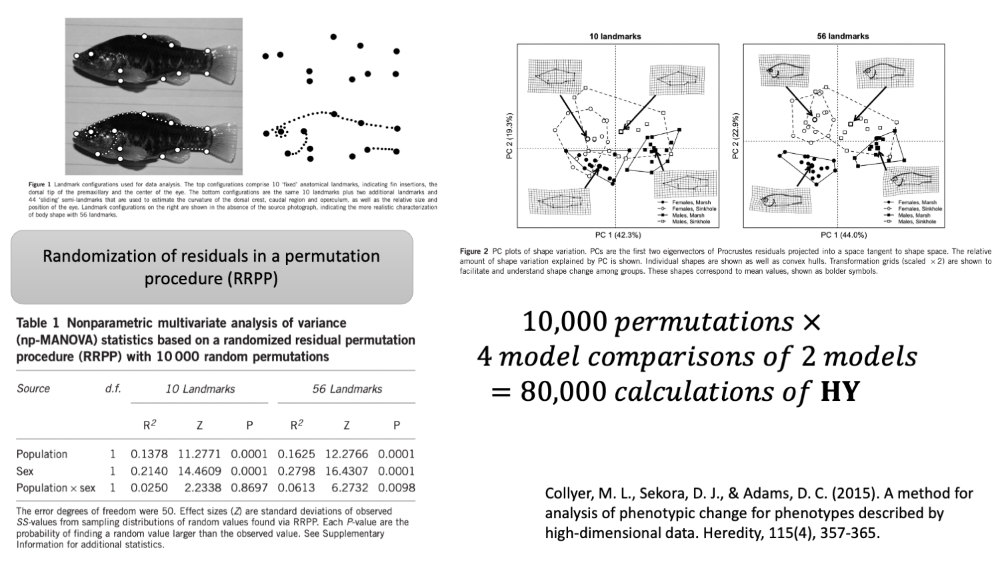
```

#### Microseconds matter!

---

### What are some of the computational strategies that can be used to lessen computational burdens?

+ $\mathbf{QR}$ Decomposition (as seen)
+ Sparse matrix algebra
  + ~~Dense matrix data storage~~
  + Only non-0 values and the locations for where they occur in a matrix (requires less memory... **maybe**)
  + Avoids many $0 \times something$ calculations

Let's see if sparse matrix algebra might improve computation, with a more robust (asymmetry) example
---

### Sparse matrix approach

.med[
```{r, include=TRUE, echo = TRUE}
subject <- factor(rep(1:400, each = 2))
side <- factor(rep(c(1, 2), 400))
X <- model.matrix(~ side)
Y <- matrix(rnorm(nrow(X) * 20), nrow(X), 20)
Q <- qr.Q(qr(X))
H <- tcrossprod(Q)
object.size(H)

Hs <- Matrix(H, sparse = TRUE)
object.size(Hs)
  
```
]

---

### Sparse matrix approach

.small2[
```{r, include=TRUE, echo = TRUE, out.width='40%', fig.align='center'}
autoplot(microbenchmark(H %*% Y, Hs %*% Y, times = 50), log = FALSE)
  
```
]

---

### Sparse matrix approach

However...


.small2[
```{r, include=TRUE, echo = TRUE, out.width='35%', fig.align='center'}
Q <- qr.Q(qr(X))
autoplot(microbenchmark(sum((H %*% Y)^2), 
               sum((Hs %*% Y)^2), 
               sum(crossprod(Q, Y)^2), times = 50), log = FALSE)
```
]

---
### What are some of the computational strategies that can be used to lessen computational burdens?

+ $\mathbf{QR}$ Decomposition 
+ ~~Sparse matrix algebra~~

Right?
####Right?
###Right?

---

### What are some of the computational strategies that can be used to lessen computational burdens?

+ $\mathbf{QR}$ Decomposition 
+ ~~Sparse matrix algebra~~

Right?
####Right?
###Right?

## *Not so fast!*
---

## *Not so fast!*


```{r, include=TRUE, echo = TRUE}
X <- model.matrix(~ subject/side) # subject + subject:side
Q <- qr.Q(qr(X))
Hs <- Matrix(tcrossprod(Q), sparse = TRUE)

object.size(Q)
object.size(Hs)

```

---
## *Not so fast!*

.small[
```{r, include=TRUE, echo = TRUE, out.width='35%', fig.align='center'}
autoplot(
  microbenchmark(sum((Hs %*% Y)^2), 
                 sum(crossprod(Q, Y)^2), 
                 times = 50),
  log = FALSE)
```
]

---

### What have we learned thus far?

#### Basically, there are multiple ways to "skin a cat"
#### Knowing what kind of cat you have might infer the best way to skin it.

How to do this as a programmer is another challenge... Let's return to this later!

---

### How some solutions introduce new challenges 

I wish to change gears for a moment.  Let's consider an example like this

```{r, echo=FALSE, out.width="80%", fig.align='center'}
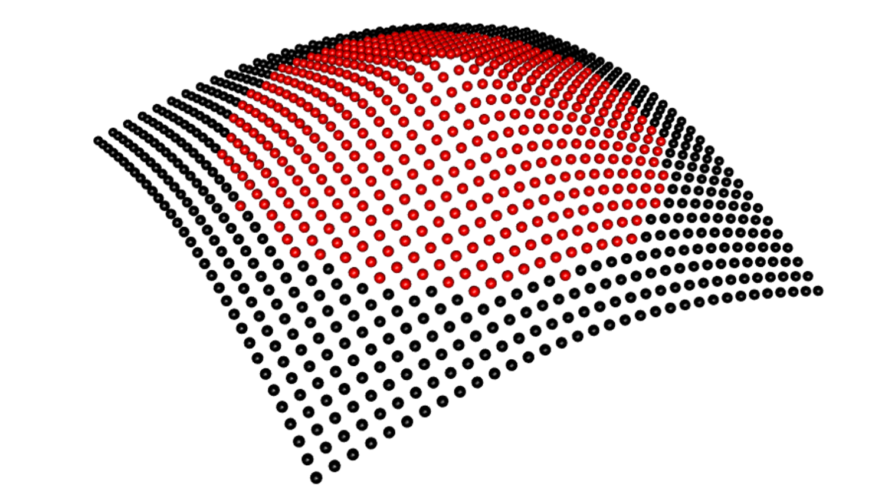
```
---

### How some solutions introduce new challenges 

Sliding semilandmarks is a computational burden!  **Why?**
```{r, echo=FALSE, out.width="80%", fig.align='center'}
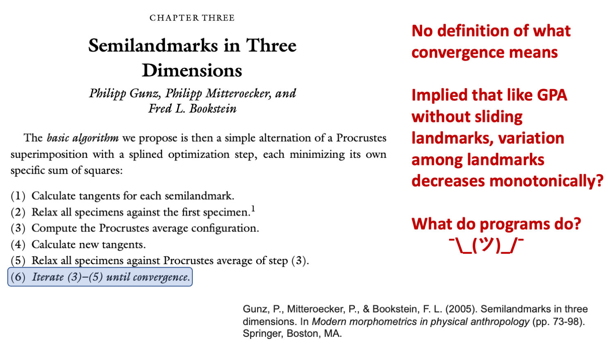
```

---

### How some solutions introduce new challenges 

Sliding semilandmarks is a computational burden!  **Why?**

$$
\mathbf{H} = - \left( \mathbf{U}^T \mathbf{L}_k^{-1} \mathbf{U}\right)^{-1} \mathbf{U}^T \mathbf{L}_k^{-1},
$$
+ $\mathbf{U}$ is a $pk \times q$ matrix for $p$ landmarks 
  + $q = p$ if semilandmarks appear only on curves
  + $q=2p$ if semilandmarks appear only on surfaces
  + $q=3p$ if semilandmarks appear on both. 
+ $\mathbf{L}_k$ is a $pk \times pk$ matrix that needs to be inverted!
+ Boy howdy are there a lot of 0s in all of this morass!

For this example:

```{r, echo=FALSE, out.width="10%", fig.align='center'}

```

1,089 points in 3 dimensions: $\mathbf{L}_k$ is a $3,267 \times 3,267$ matrix.  

That must be inverted for every landmark configuration!  In every iteration!!


---

### How some solutions introduce new challenges 


Note that $\mathbf{z}$ is a $pk \times 1$ vector of coordinates (vectorized form of landmark coordinates that is updated in every iteration)

### Linear Model Checkers:

1. Calculate $\mathbf{A} = \mathbf{U}^T\mathbf{L}_K^{-1}$
2. Calculate $\mathbf{B} = \mathbf{Az}$
3. Calculate $\mathbf{C} = \mathbf{AU}$
4. Remove $\mathbf{A}$ (to save computer memory)
5. Calculate $\mathbf{UC}^{-1}\mathbf{B} = \mathbf{Hz}$

Repeated for every specimen, in every iteration

**Translation: A lot of time and computer memory can be saved by not calculating $\mathbf{H}$ but instead finding and discarding the parts that $\mathbf{H}$ comprises.**
---

### How does linear model checkers improve computation?

```{r, echo=FALSE, out.width="80%", fig.align='center'}
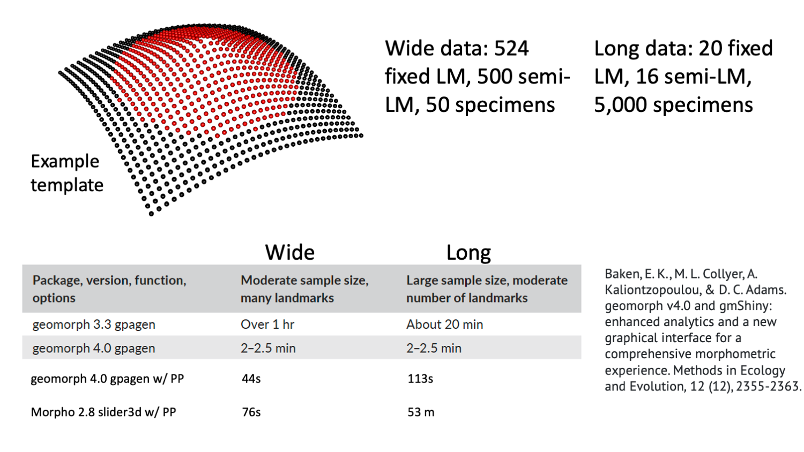
```

---

### How overcoming some challenges introduces new opportunities

#### But...

$$\mathbf{A} = \mathbf{U}^T\mathbf{L}_K^{-1}$$

Is still pretty intense, especially inverting $\mathbf{L}_K^{-1}$.  Do we need all of these fixed landmarks to mess with sliding semi-landmarks?

```{r, echo=FALSE, out.width="25%", fig.align='center'}

```

What if we use, say, a uniform sample of $50\%$ of the fixed landmarks?

+ E.g., wide data:  0.5 * 524 fixed + 500 semilandmarks = 757 points (instead of 1,024; a $\mathbf{L}_k$ matrix with 641,601 fewer elements).

**Translation: we can save a lot of time by excising landmarks that are not really needed for some solutions.**

---

### Bending Energy via approximate TPS for GPA with sliding semilandmarks

+ Use only a portion of fixed landmarks.
+ More easily in vert bending energy matrices
+ Can use parallel processing more efficiently
+ Can run more iterations in shorter time if desired.

---

### Bending Energy via approximate TPS for GPA with sliding semilandmarks

```{r, echo=FALSE, out.width="80%", fig.align='center'}
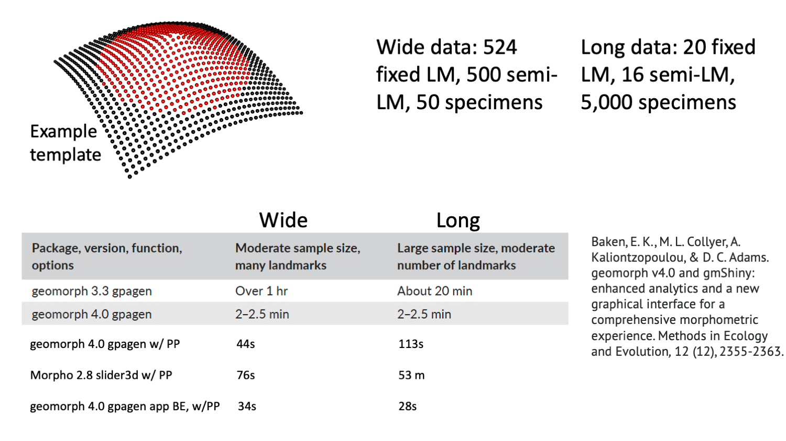
```

---
### Bending Energy via approximate TPS for GPA with sliding semilandmarks

Honest results?
```{r, echo=FALSE, out.width="80%", fig.align='center'}
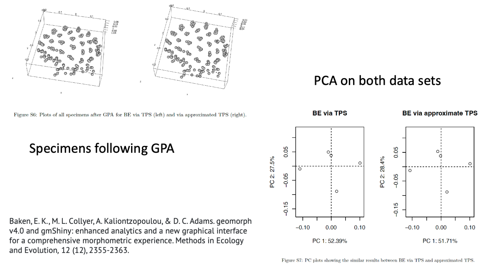
```

---

### Linear model checkers extend from data acquisition to data analysis!

```{r, echo=FALSE, out.width="60%", fig.align='center'}
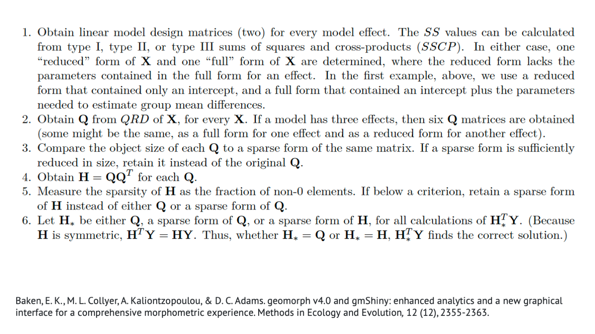
```

**Translation: For analysis of variance via RRPP, linear model checkers is more of a machine-learning algorithm, capable of identifying the most facile ways to calculate $SS$, for any model term, in every iteration.**

**Linear model checkers can skin multiple diverse cats multiple ways at the same time.**

---

### Linear model checkers extend from data acquisition to data analysis!

```{r, echo=FALSE, out.width="90%", fig.align='center'}
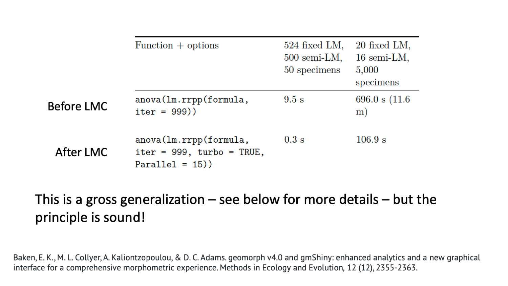
```

**Translation: `RRPP` and `geomorph` `R` packages are now pretty fast**

**`RRPP` and `geomorph` `R` packages are also poised for very large data analysis.**

---

### A quasi-conclusion, a new frontier, and some caveats

#### Conclusion: Linear model checkers (algorithms) are a dynamic way to confront the increasingly big-data challenges in geometric morphometrics.

#### New (or forgotten) Frontier: Semilandmarks and/or surface morphology

+ Bending energy is maybe not the only spatial process for semilandmarks to consider (minimized Procrustes distance is spatial independence)
+ Bending energy via approximate TPS might offer better solutions (or not).  More research is needed.

---

### A quasi-conclusion, a new frontier, and some caveats

#### Caveat 1: GPA should be more exploratory than it might be currently considered


```{r, echo=FALSE, out.width="80%", fig.align='center'}
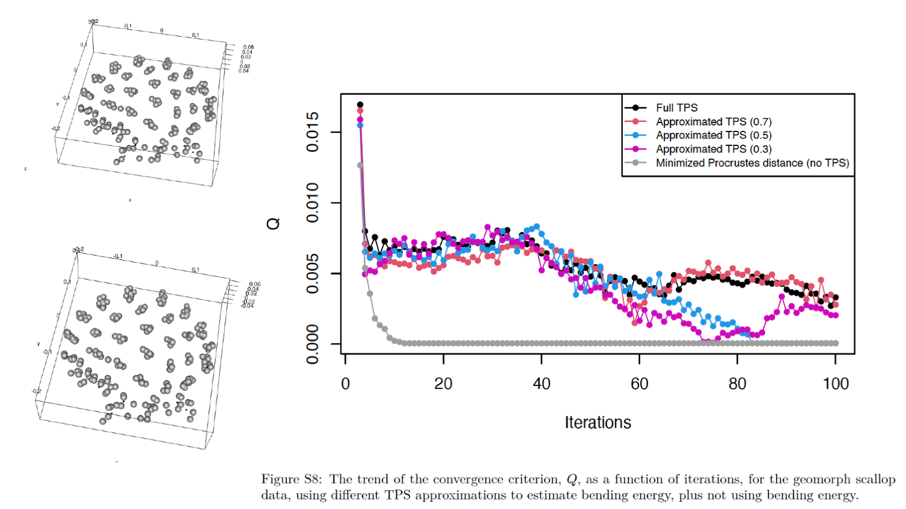
```

---


### A quasi-conclusion, a new frontier, and some caveats

#### Caveat 2: There are many unexplored details with sliding semilandmarks
+ e.g., how many or how dense should semilandmarks used to find tangent planes be?
+ e.g., if semilandmark fields are dense and uniform, is there really any reason to use bending energy?
+ e.g., should other spatial processes be considered?

#### Caveat 3: Combining landmark configurations to define complex morphologies?

+ We have attacked this concept a little: Collyer, M. L., Davis, M. A., & Adams, D. C. (2020). Making heads or tails of combined landmark configurations in geometric morphometric data. Evolutionary Biology, 47, 193-205.
+ We provided a general, weighted approach for combining multiple configurations from research subjects for complex morphological descriptions.
+ **But guidelines for best practices (for weighting) for empirical studies are sorely needed.**

---

# Acknowledgments

Dean Adams

NSF Research grants: DEB 1745482, DBI 1902694, DEB 2146220


